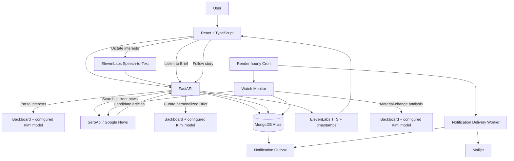

# Dispatch

**Your news, without the noise.**
A personalized AI news agent that builds concise briefs, follows developing stories, and alerts you only when something meaningfully changes.

[Live app](https://dispatch-55oo.onrender.com/) · [GitHub repository](https://github.com/danishirfan21/Dispatch-News-Agent)

---

## Why Dispatch exists

Dispatch started with a request from my friend Hammad: he wanted an AI news scanner that could understand a user's interests and turn the day's reporting into a short brief that was actually worth catching up on.

That simple idea exposed a bigger problem: **getting more news is easy; knowing what is new, relevant, and worth interrupting you for is hard.**

Dispatch therefore does more than summarize headlines. It learns what you care about, creates a personalized Brief, remembers the state of stories you follow, checks fresh coverage over time, and distinguishes a genuine development from another article repeating the same facts.

The result is a news workflow built around **signal instead of volume**.

## What it can do

### Personalized Briefs

Describe what you want to follow in plain language. Dispatch parses those interests into structured topics, searches current Google News results, and uses AI to curate up to five strong stories with a concise explanation of **why each story matters to you**.

### Dictate your interests

Prefer speaking to typing? Dispatch can record your voice in the browser and transcribe it with ElevenLabs before parsing your interests. The audio is used for transcription and is not persisted by the application.

### Listen to your Brief

Dispatch can narrate the latest saved Brief with ElevenLabs text-to-speech. Character-level timestamps are mapped back to headline and summary segments so the interface can highlight the text currently being spoken.

### Follow developing stories

Any Brief story can become a persistent **Watch**. Dispatch stores what you already know about that story and uses that state as the baseline for future checks.

### Define what is worth an alert

A Watch can include a condition such as:

> Notify me when API access is publicly available.

A development can be real without satisfying your condition. Dispatch keeps those two decisions separate, so it can update the story without necessarily notifying you.

### Detect meaningful change

When a Watch is checked, Dispatch retrieves fresh coverage and asks the AI for a structured decision about whether the underlying story actually changed. That decision is then passed through deterministic safeguards:

1. the model must cite article IDs that exist in the newly retrieved evidence;
2. a claimed development is compared against recent development history to suppress likely duplicates;
3. no-change checks preserve the existing known state;
4. custom notification conditions are evaluated independently from material change.

### Monitor automatically

A Render Cron job runs hourly, finds due active Watches, checks them, records verified developments, and then processes pending email notifications. The cron process invokes the Python services directly rather than depending on the web service being awake.

### Email only when it matters

Mailjet handles outbound notification email. Notifications are written to a MongoDB outbox first, claimed atomically by the delivery worker, and retried on retryable failures to reduce duplicate sends and lost alerts.

## How it works



## AI at the core

Dispatch routes its LLM work through **Backboard**. The configured provider/model are environment-driven; the repository example targets OpenRouter with `~moonshotai/kimi-latest`.

The AI is used for three core product decisions:

- **Interest parsing** — converts natural-language preferences into structured topics, search terms, and exclusions.
- **Brief curation** — ranks and merges candidate articles, discards weak matches, and produces concise personalized story cards.
- **Watch analysis** — decides whether fresh evidence represents a material change, whether a user's custom condition is satisfied, and what the new known state should be.

The model output is always requested as structured JSON and validated before the application uses it.

## Meaningful-change pipeline

The Watch pipeline is deliberately conservative.

```text
Stored Watch state
      ↓
Focused Google News search
      ↓
Ignore already-seen URLs
      ↓
AI structured analysis
      ↓
Verify cited article IDs
      ↓
Check against recent development history
      ↓
Material change?
  ├─ No  → keep known state unchanged
  └─ Yes → persist development + update known state
                         ↓
                 Notification policy
                  ├─ no condition → notify
                  ├─ condition false → do not notify
                  └─ first satisfaction → notify once
```

Recent development summaries are compared using `difflib.SequenceMatcher` as an additional duplicate guard. A similarity ratio of `>= 0.6` is treated as a likely repeat.

## Tech stack

| Layer | Technology |
|---|---|
| Frontend | React 19, TypeScript, Vite, Tailwind CSS 4 |
| Backend | FastAPI, Pydantic, Uvicorn |
| Database | MongoDB Atlas via Motor |
| AI routing | Backboard |
| Configured LLM | Kimi via OpenRouter (`~moonshotai/kimi-latest`) |
| News retrieval | SerpApi Google News |
| Speech-to-text | ElevenLabs Scribe v2 |
| Text-to-speech | ElevenLabs `eleven_multilingual_v2` |
| Email | Mailjet |
| Authentication | Argon2 + JWT in HttpOnly cookie |
| Hosting | Render Web Service + Render Cron |

## Main product flow

1. A first-time visitor sees the short onboarding carousel.
2. The user registers or signs in.
3. They type or dictate what they want to follow.
4. Dispatch parses the request into structured interests.
5. SerpApi retrieves current Google News coverage.
6. Backboard routes the AI curation step and Dispatch saves the resulting Brief.
7. The user can read or listen to the Brief.
8. Any story can be followed as a Watch.
9. The user can optionally define a precise notification condition.
10. Manual checks and the hourly monitor reuse the same meaningful-change pipeline.
11. Verified developments are added to the story timeline.
12. Notification-worthy developments enter the outbox and are delivered by Mailjet.

## Routes

| Route | Purpose | Access |
|---|---|---|
| `/welcome` | First-time onboarding | Public |
| `/login` | Sign in | Public |
| `/register` | Create account | Public |
| `/setup` | Define interests and build a Brief | Protected |
| `/brief` | Latest personalized Brief | Protected |
| `/watching` | Followed stories | Protected |
| `/watching/:id` | Watch state, criteria, checks, timeline | Protected |

On mobile, the primary destinations move into a fixed bottom navigation while account actions remain in the compact top header.

## Important API endpoints

| Method | Endpoint | Purpose |
|---|---|---|
| `GET` | `/api/health` | Health check |
| `POST` | `/api/auth/register` | Register |
| `POST` | `/api/auth/login` | Login |
| `POST` | `/api/auth/logout` | Logout |
| `GET` | `/api/auth/me` | Current user |
| `GET` / `PUT` | `/api/profile` | Load/save interests profile |
| `POST` | `/api/interests/parse` | Parse free-text interests with AI |
| `POST` | `/api/news/search` | Retrieve current news |
| `POST` | `/api/brief/generate` | Generate and persist a Brief |
| `GET` | `/api/brief/latest` | Load latest saved Brief |
| `POST` | `/api/voice/transcribe` | ElevenLabs speech-to-text |
| `GET` | `/api/brief/audio` | Generate narrated Brief with timestamps |
| `POST` / `GET` | `/api/watches` | Create/list Watches |
| `GET` / `PATCH` / `DELETE` | `/api/watches/{id}` | Read/update/delete a Watch |
| `POST` | `/api/watches/{id}/check` | Manually run meaningful-change analysis |
| `GET` | `/api/watches/{id}/developments` | Development timeline |
| `POST` | `/api/internal/monitor/run` | Protected manual monitor trigger |
| `POST` | `/api/internal/notifications/deliver` | Protected manual delivery trigger |

## Persistence

MongoDB stores the user-facing state that makes Dispatch more than a stateless summarizer:

- `users`
- `profiles`
- `briefs`
- `watches`
- `watch_developments`
- `notifications`

Important indexes include unique user emails, one profile per user, one Watch per `(user_id, story_id)`, due-Watch lookup on `(status, next_check_at)`, and idempotent notification creation on `(development_id, type)`.

## Notification delivery

Notifications use a small transactional-outbox pattern:

```text
pending → processing → sent
                   └→ pending (retry)
                   └→ failed
```

A worker atomically claims one due notification at a time. Retryable failures back off after approximately 5 minutes and 15 minutes, with a maximum of three attempts before the notification is marked failed.

## Security notes

- Passwords are hashed with **Argon2**.
- Authentication uses a signed JWT stored in an **HttpOnly cookie**.
- Production cookies are `Secure`, `SameSite=Lax`, and scoped to `/`.
- The frontend does not store authentication tokens in `localStorage`.
- Backend repository operations scope user data by `user_id`.
- Internal operational endpoints use a separate `MONITOR_SECRET` Bearer token and constant-time comparison.
- The onboarding `localStorage` flag is UX-only and carries no authentication or authorization meaning.
- Secrets stay server-side through environment variables and are not shipped in the Vite bundle.

## Local development

### Prerequisites

- Node.js/npm compatible with Vite 8
- Python **3.12** (the repository pins `3.12.6`)
- MongoDB / MongoDB Atlas
- Backboard account/API key
- SerpApi account/API key
- ElevenLabs account/API key
- Mailjet credentials if you want to test outbound email

### 1. Clone the repository

```bash
git clone https://github.com/danishirfan21/Dispatch-News-Agent.git
cd Dispatch-News-Agent
```

### 2. Install frontend dependencies

```bash
npm install
```

### 3. Configure the backend

```bash
cd backend
python -m venv .venv
```

Activate the virtual environment using the command appropriate for your OS, then:

```bash
pip install -r requirements.txt
```

Create your local environment file from the example:

```bash
cp .env.example .env
```

On Windows PowerShell you can use:

```powershell
Copy-Item .env.example .env
```

Fill in the required values in `backend/.env`.

### 4. Run the backend

From `backend/`:

```bash
uvicorn app.main:app --reload --host 127.0.0.1 --port 8000
```

### 5. Run the frontend

In another terminal from the repository root:

```bash
npm run dev
```

Vite proxies `/api` requests to `http://127.0.0.1:8000` during local development.

## Environment variables

The authoritative list lives in `backend/.env.example`.

<details>
<summary>Web service configuration</summary>

```text
APP_ENV
BACKBOARD_API_KEY
BACKBOARD_BASE_URL
BACKBOARD_MODEL
BACKBOARD_LLM_PROVIDER
SERPAPI_API_KEY
SERPAPI_BASE_URL
SERPAPI_RESULTS_PER_INTEREST
FRONTEND_ORIGIN
MONGODB_URI
MONGODB_DB_NAME
JWT_SECRET
JWT_ALGORITHM
JWT_EXPIRES_MINUTES
COOKIE_SECURE
ELEVENLABS_API_KEY
ELEVENLABS_BASE_URL
ELEVENLABS_STT_MODEL
ELEVENLABS_VOICE_ID
ELEVENLABS_TTS_MODEL
MONITOR_SECRET
WATCH_CHECK_INTERVAL_MINUTES
WATCH_MONITOR_BATCH_SIZE
MAILJET_API_KEY
MAILJET_SECRET_KEY
MAIL_FROM_EMAIL
MAIL_FROM_NAME
NOTIFICATION_DELIVERY_BATCH_SIZE
```

</details>

<details>
<summary>Render Cron configuration</summary>

The cron service only needs the subset required for monitoring, AI/news retrieval, MongoDB, and email delivery. It does not need JWT/cookie/ElevenLabs variables because it does not serve HTTP requests or perform speech features.

</details>

## Production deployment

Dispatch runs on Render as two services:

### Web service

The production build creates the Vite frontend and installs the Python backend. FastAPI then serves both the API and the built React SPA from the same origin.

```text
Build: npm ci && npm run build && pip install -r backend/requirements.txt
Start: cd backend && uvicorn app.main:app --host 0.0.0.0 --port $PORT
Health: /api/health
```

Unknown frontend routes fall back to `index.html` for client-side routing; unknown `/api/*` routes remain API 404s rather than returning the SPA.

### Cron service

```text
Schedule: 0 * * * *
Command: cd backend && python -m app.jobs.run_monitor_cycle
```

Each cycle runs Watch monitoring and then notification delivery directly through the Python service layer.

## Tests

The backend includes focused standalone test scripts for the most failure-sensitive parts of the application:

- `backend/tests/test_watch_analysis.py`
- `backend/tests/test_watch_monitor.py`
- `backend/tests/test_watch_check_endpoint.py`
- `backend/tests/test_notification_delivery.py`
- `backend/tests/test_run_monitor_cycle.py`

They cover material-change analysis, citation verification, duplicate suppression, condition behavior, user isolation, cron behavior, delivery retries, idempotency, and concurrent notification claiming.

Frontend quality checks:

```bash
npm run build
npm run lint
```

There is currently no automated frontend test suite.

## Repository structure

```text
Dispatch-News-Agent/
├── src/
│   ├── api/                 # Typed frontend API clients
│   ├── components/          # Shared UI, header, mobile nav, story/watch cards
│   ├── context/             # Authentication state
│   ├── hooks/               # Voice dictation and Brief narration
│   ├── screens/             # Onboarding, auth, setup, Brief, Watching
│   └── utils/               # Onboarding/routing/time helpers
├── backend/
│   ├── app/
│   │   ├── jobs/            # Scheduled monitor entrypoint
│   │   ├── services/        # AI, news, speech, watch, email services
│   │   ├── main.py          # FastAPI app and routes
│   │   ├── repositories.py  # MongoDB data access
│   │   ├── security.py      # Argon2 + JWT
│   │   └── config.py        # Environment-driven settings
│   └── tests/
├── public/
│   └── brand/               # Dispatch brand assets
├── design-reference/        # Static UI design references
├── render.yaml              # Render web + cron services
└── package.json
```

## Built for Hacktoberfest 2026

Dispatch was built for the **Hacktoberfest 2026 Weekend Challenge: Build for a Friend**.

The project began with a real friend's need for a faster way to catch up on relevant news and evolved into a persistent AI news agent centered on one question:

**Did anything actually change?**

That question shaped the Brief, Watches, meaningful-change pipeline, story history, and notification policy.

## Integrations

- **Backboard** — routes the structured AI workflows used for interest parsing, Brief curation, and meaningful-change analysis.
- **SerpApi** — retrieves current Google News coverage.
- **MongoDB Atlas** — persists profiles, Briefs, Watches, developments, and the notification outbox.
- **ElevenLabs** — speech-to-text for interest dictation and timestamped text-to-speech for narrated Briefs.
- **Mailjet** — transactional email for Watch notifications.
- **Render** — hosts the same-origin web service and the independent hourly monitoring cron job.

## Current limitations

Dispatch intentionally keeps the current scope focused. It does not currently include:

- push notifications;
- password reset/email verification;
- per-Watch schedule controls in the UI;
- persistent TTS audio caching;
- a frontend automated test suite;
- configurable narration voice selection in the UI.

The duplicate-development guard is also a heuristic: it compares a proposed development against the five most recent summaries using a fixed text-similarity threshold.

---

**Dispatch**
Stories curated around what you follow.
